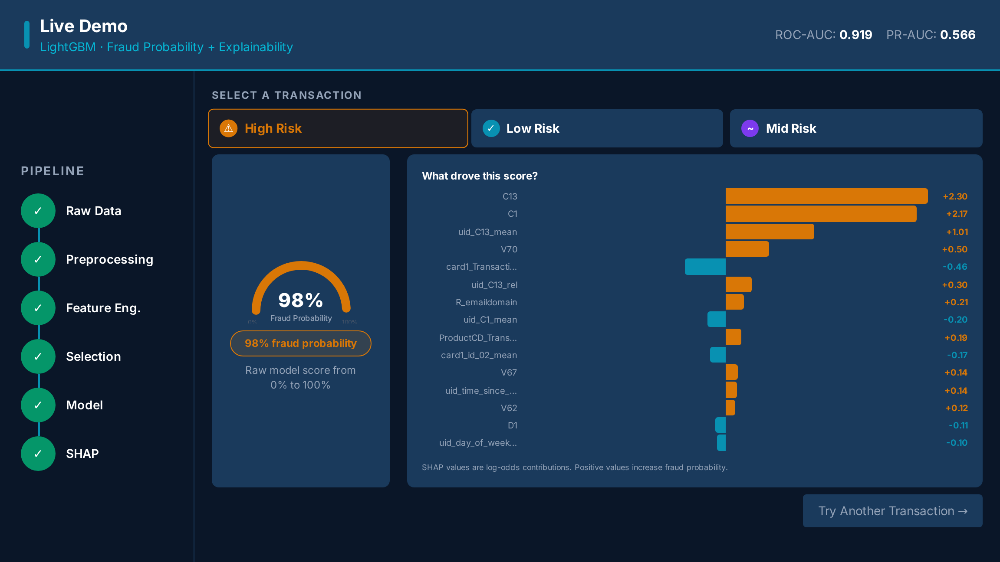
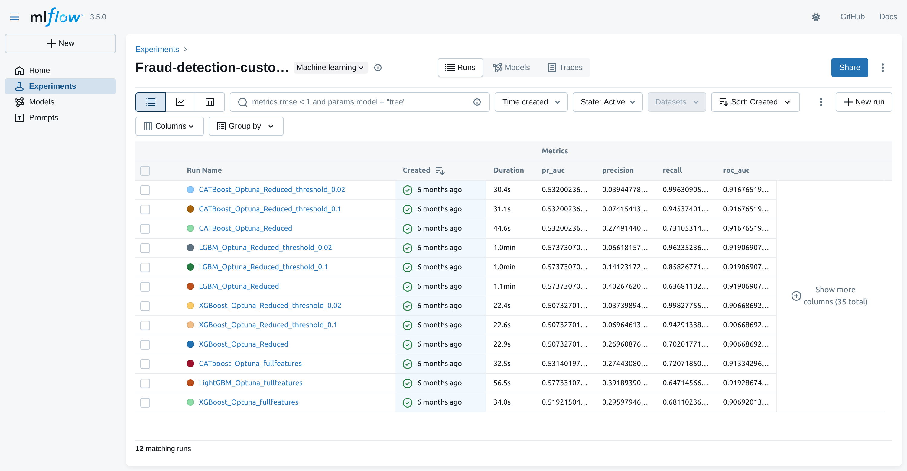
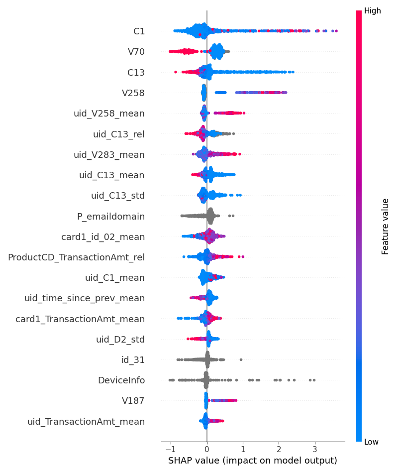

# Machine Learning for Fraud Detection in Online Financial Transactions

MSc thesis, National and Kapodistrian University of Athens. Graded 10/10.

A leakage-safe experimental study of gradient boosting models for card fraud detection on the
IEEE-CIS dataset, built and evaluated like a system with a lifecycle rather than a single notebook:
chronological evaluation, tracked experiments, bootstrap confidence intervals, SHAP-driven feature
selection, and a serving layer that returns an explanation alongside every score.



## The problem

Only about 3.5% of transactions in the dataset are fraudulent. A classifier that approves
everything scores 96.5% accuracy and is worthless, so accuracy is not a meaningful target. The real
question is operational: how much fraud are you willing to miss in order to avoid blocking paying
customers?

## Research questions

1. How well do XGBoost, LightGBM and CatBoost discriminate fraud from legitimate transactions?
2. What does majority-class downsampling change?
3. Can a much smaller feature set, chosen by cross-model importance agreement, hold the same performance?
4. How does the decision threshold affect recall and precision in practice?

## How it was built

The methodology mattered more here than the modelling, because most of the ways to get a flattering
fraud detection number are also ways to fool yourself.

**Chronological evaluation.** Transactions are sorted by `TransactionDT`, the first 80% used for
training and the final 20% held out and never touched. A random split scores higher and lies, because
fraud patterns shift over time. The holdout never informed tuning, feature selection or threshold
choice, and it was never downsampled: it keeps the original imbalanced distribution.

**Tuning inside the training window.** Optuna hyperparameter search runs with expanding
time-series cross-validation, entirely within the training period.

**Tracked experiments.** Every run is logged to MLflow with its parameters, metrics and artifacts,
which is what makes "which configuration produced this number" answerable months later.



**Confidence intervals, not just point estimates.** Every metric carries a bootstrap confidence
interval over 200 resamples (`_bootstrap_ci` in `evaluate_models_util.py`), so a gap between two
models can be told apart from noise. This turns out to matter: see the results below.

**Feature selection by cross-model agreement.** SHAP values were computed per model and a feature
kept only if at least two of the three models ranked it in their top 30%, cutting the input space
from 748 engineered features to 215.



**Explainable serving.** A FastAPI service loads the logged MLflow model and returns a fraud
probability together with the SHAP contributions behind it, because a score nobody can interrogate is
not much use to a fraud team.

## Results

Held-out test set, original imbalanced distribution. Downsampling (1:5) applied to training data only.

| Run | ROC AUC | 95% CI | PR AUC | Precision | Recall | F1 |
|---|---|---|---|---|---|---|
| LightGBM, full features | 0.9193 | [0.9147, 0.9242] | 0.5773 | 0.3919 | 0.6471 | 0.4882 |
| LightGBM, reduced | 0.9191 | [0.9141, 0.9236] | 0.5737 | 0.4027 | 0.6368 | 0.4934 |
| CatBoost, full features | 0.9133 | [0.9080, 0.9181] | 0.5314 | 0.2744 | 0.7207 | 0.3975 |
| CatBoost, reduced | 0.9168 | [0.9118, 0.9212] | 0.5320 | 0.2749 | 0.7311 | 0.3996 |
| XGBoost, full features | 0.9069 | [0.9019, 0.9123] | 0.5192 | 0.2960 | 0.6811 | 0.4126 |
| XGBoost, reduced | 0.9067 | [0.9016, 0.9114] | 0.5073 | 0.2696 | 0.7020 | 0.3896 |

**LightGBM ranked highest, but the confidence intervals are the honest story.** LightGBM
[0.9141, 0.9236] and CatBoost [0.9118, 0.9212] overlap substantially, so on this data that gap is not
distinguishable from noise. XGBoost's interval does not overlap LightGBM's, so that difference is
real. Reporting only the point estimates would have implied a three-way ranking the evidence does not
support.

**Feature reduction is close to free.** Cutting 748 features to 215 moved LightGBM's ROC AUC by
0.0002, which says the expanded feature space carried substantial redundancy.

**The threshold dominates everything.** Same LightGBM model, same predictions, three operating points:

| Threshold | Precision | Recall | F1 |
|---|---|---|---|
| 0.5 (default) | 0.4027 | 0.6368 | 0.4934 |
| 0.1 | 0.1412 | 0.8583 | 0.2426 |
| 0.02 | 0.0662 | 0.9624 | 0.1238 |

Moving one number, chosen by a human, swings the behaviour of the system far harder than the choice
of model does. The model ranks risk; the business decides where to cut, based on review capacity and
the relative cost of a missed fraud versus a false alarm. `evaluate_models_util.py` includes a
cost-optimal threshold search (`_find_cost_optimal_threshold`) for exactly this reason.

## What this is not

This is a controlled experimental study on a public benchmark, not a production fraud system. Known
limitations, in rough order of how much they matter:

- The dataset is anonymised, so there is no real customer identifier. Behavioural aggregate features
  are anchored on a simulated user proxy built from `card1`, `addr1` and an account-age proxy.
- No probability calibration, so the scores rank well but should not be read as true probabilities.
- No cost model behind the threshold, no drift monitoring, and no evaluation over a long enough
  horizon to say anything about degradation.
- SHAP explains model attribution. It does not establish causality.
- The serving layer is a demo. There is no containerisation, CI, test suite or data versioning.

These are the next things worth building, not caveats to wave away.

## Dataset

- Competition page: https://www.kaggle.com/competitions/ieee-fraud-detection/data
- Local dataset folder in this repo: `ieee-fraud-detection-data/`
- Detailed dataset notes: `Detailed-Description.md`

590,540 labelled transactions, 434 original columns, expanded to 748 features by feature engineering
and reduced to 215 by SHAP agreement.

## Repository Structure

- `EDA_and_preprocessing.ipynb`: exploratory analysis and feature engineering workflow
- `training.ipynb`: experiment/training notebook
- `train_models_util.py`: reusable model training helpers (XGBoost, CatBoost, LightGBM, baselines)
- `evaluate_models_util.py`: evaluation metrics, plots, threshold selection, MLflow logging
- `feature_importance.py`: SHAP-based global and case-level explainability helpers
- `cleanup.py`: utility to delete MLflow runs marked as deleted
- `mlruns/`: MLflow tracking artifacts
- `fastapi/`: API service code (`main.py`, request schema, config)
- `presentation/`: React slide deck used for the defence, including the live demo

## Environment Setup

1. Create and activate a Python environment (recommended: Python 3.10+).
2. Install dependencies:

```bash
pip install -r requirements.txt
```

## Typical Workflow

1. Place/unzip the IEEE-CIS data under `ieee-fraud-detection-data/`.
2. Run `EDA_and_preprocessing.ipynb` to prepare features.
3. Run `training.ipynb` for model training and experiment tracking.
4. Use utilities from:
   - `train_models_util.py` for model fitting/tuning
   - `evaluate_models_util.py` for model evaluation and artifact generation
   - `feature_importance.py` for SHAP explainability outputs

## MLflow

Start the MLflow UI from the project root:

```bash
mlflow ui
```

Then open the local URL shown in terminal (commonly `http://127.0.0.1:5000`).

## FastAPI Inference Service

The API is under `fastapi/` and loads a model from an MLflow model path configured in `fastapi/main.py`.

1. The API key is read from the `FRAUD_API_KEY` environment variable, defaulting to a documented
   development value. It is a demo-only shared secret, not a real credential.
2. Verify the model path in `fastapi/main.py` points to an existing local MLflow model.
3. Start the service from project root:

```bash
uvicorn fastapi.main:app --reload --host 0.0.0.0 --port 8000
```

4. Call the prediction endpoints:
- `POST /predict` and `POST /predict_explain` require the `X-API-Key` header
- `GET /examples` is open
- body: JSON matching `fastapi/model.py` (`PredictionRequest`)

To run the slide deck with the live demo, `make run` from the project root starts both services.

## Notes

- This repository tracks generated artifacts (`mlruns/`, search plots, etc.).
- `cleanup.py` can remove run folders whose `meta.yaml` has `lifecycle_stage: deleted`.
